# spark-experiment

- 目的

&nbsp;&nbsp;&nbsp;&nbsp;&nbsp;&nbsp;&nbsp;&nbsp;本实验旨在评估MySQL在使用LLVM-BOLT的不同优化模式优化之后，在高负载条件下的性能表现。实验数据来源于多台服务器，这些服务器上使用 Sysbench 对 MySQL进行压力测试，生成每秒事务数（TPS）数据，同时利用 Perf 工具收集程序运行过程中的微体系结构数据。这些数据的生成不在本次实验范围内。收集到的数据被上传至 HDFS（Hadoop Distributed File System）进行集中存储。

&nbsp;&nbsp;&nbsp;&nbsp;&nbsp;&nbsp;&nbsp;&nbsp;随后，借助 Apache Spark 和 YARN（Yet Another Resource Negotiator）框架，对存储在 HDFS 中的大规模数据进行分布式处理和分析，计算关键性能指标（如 iCache misses、iTLB misses、branch misses、TPS等）。处理后的结果再次存储回 HDFS，便于后续的查询和可视化展示。通过这一流程，实验旨在利用分布式计算技术高效地分析和理解 MySQL 在不同压力条件下的性能瓶颈，为数据库优化提供数据支持和技术参考。
- 方法
&nbsp;&nbsp;&nbsp;&nbsp;&nbsp;&nbsp;&nbsp;&nbsp;客户端节点中的 Driver 作为应用程序的控制核心，负责解析应用逻辑并将其转化为可在集群执行的任务，同时与其他组件通信以监控任务状态。Spark Content 则提供应用程序与集群交互的接口，管理资源并维护运行时环境。

&nbsp;&nbsp;&nbsp;&nbsp;&nbsp;&nbsp;&nbsp;&nbsp;YARN Resource Manager 会评估集群中的可用资源，依据应用程序的需求和集群状况做出资源分配决策，例如分配包含一定内存和 CPU 核心的容器给工作节点用于启动执行器，并持续监控资源使用情况进行重新分配。同时，HDFS Name Node 负责管理 HDFS 文件系统命名空间，当应用程序请求数据时，它提供数据的元数据信息，包括文件由哪些数据块组成以及这些数据块存储在哪些数据节点上，还负责维护文件系统的目录结构和文件权限等。

&nbsp;&nbsp;&nbsp;&nbsp;&nbsp;&nbsp;&nbsp;&nbsp;YARN Node Manager 接收 YARN Resource Manager 的指令，在本地节点启动和管理容器。Executor 作为在工作节点实际执行任务的组件，从 YARN Node Manager 获取任务分配后，从 HDFS Data Node 读取数据块进行计算操作，并且利用缓存机制来提高性能。HDFS Data Node 负责存储实际的数据块，处理数据的 I/O 操作，并定期向 HDFS Name Node 发送心跳信号和数据块报告。在数据存储和处理过程中，数据被划分为多个分区和数据块，分区便于并行处理，数据块是 HDFS 存储的基本单位，分布存储在不同数据节点实现冗余存储和高效访问。
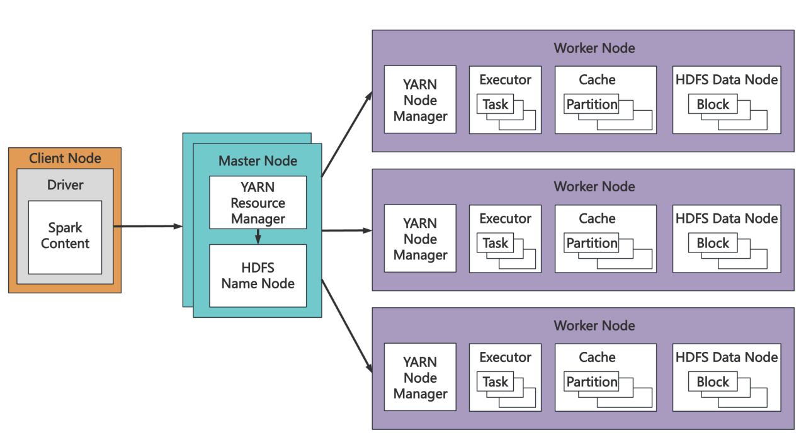
- 结果
  - 通过对原始txt文件的处理，得到下面的两个csv文件数据。
    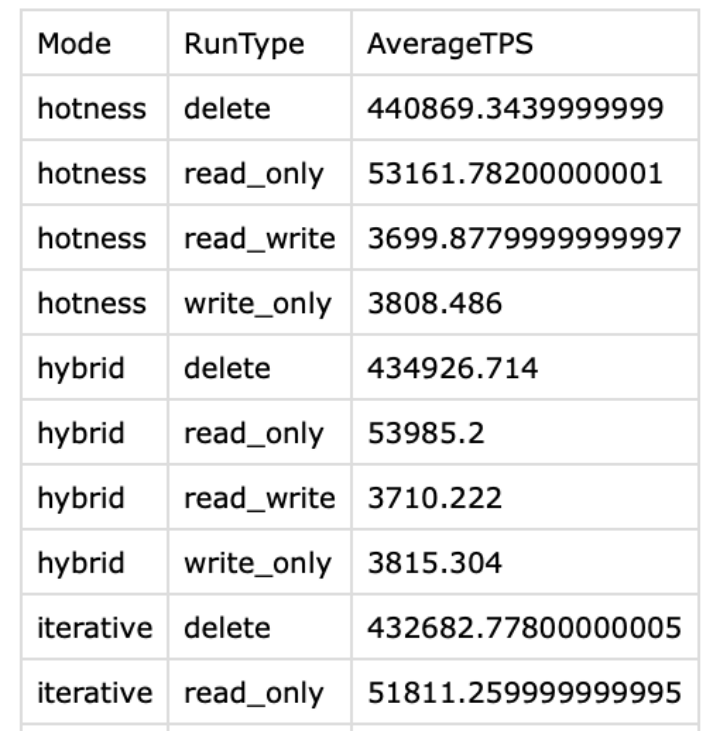 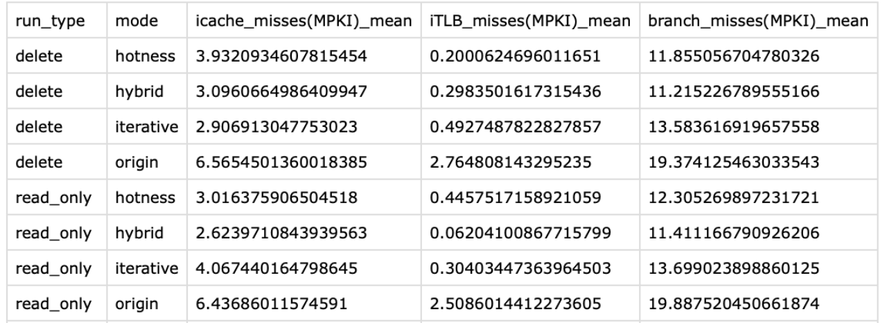
  - 通过对sysbench文件的可视化处理，得到下面的图。
	  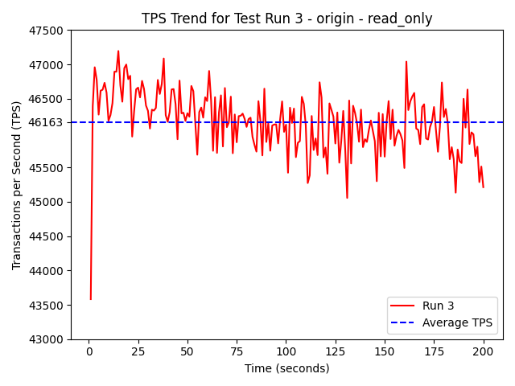{: width="240px"} 
    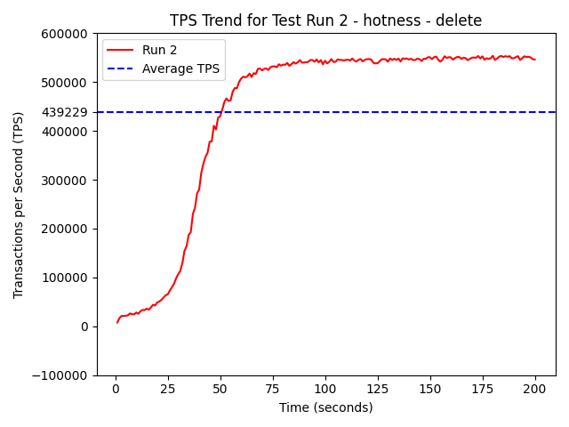  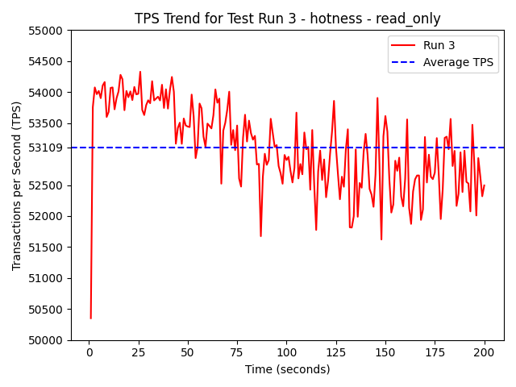{: width="240px"} 
	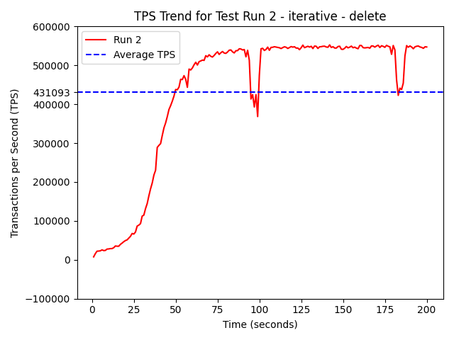  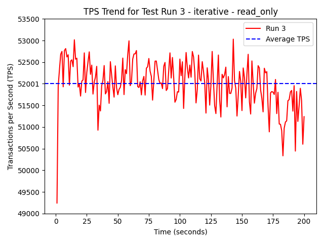{: width="240px"} 
    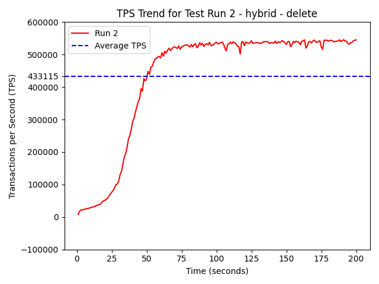  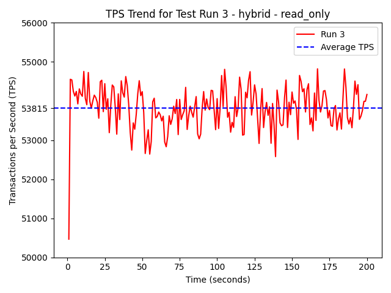{: width="240px"}  
  - 通过对csv的可视化，得到下面的图。
    _mean_comparison.png)  _mean_comparison.png) 
	_mean_comparison.png) 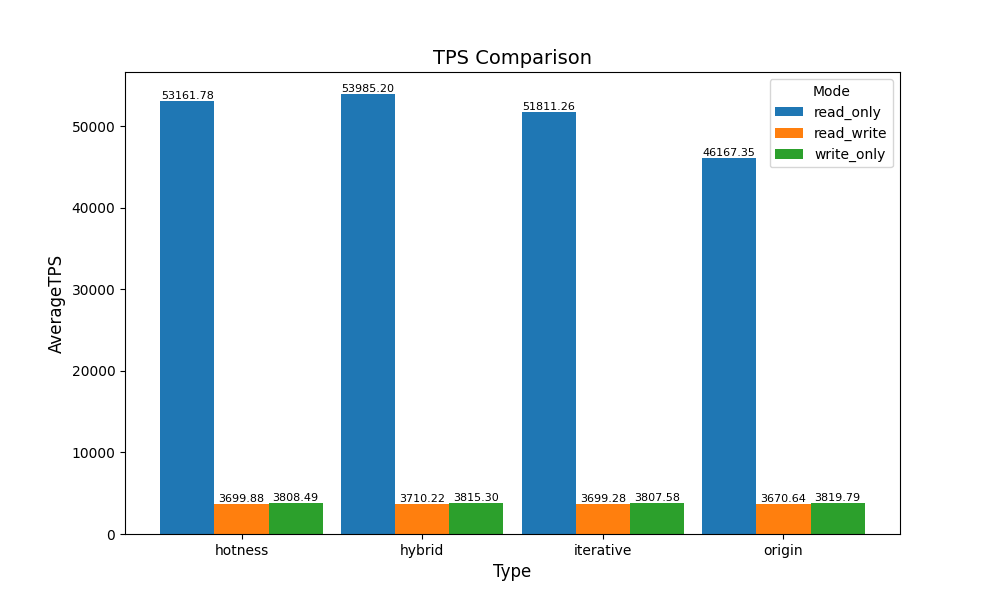
    
- 分工
	- 李雨峰(51275903028)占比25%，负责环境搭建，编写处理脚本，写PPT。
	- 谢思怡(51275903081)占比25%，负责编写处理脚本，写PPT。
	- 王千予(51275903082)占比25%，负责编写处理脚本，写PPT。
	- 曾雅楠(51275903057)占比25%，负责编写处理脚本，写PPT。
